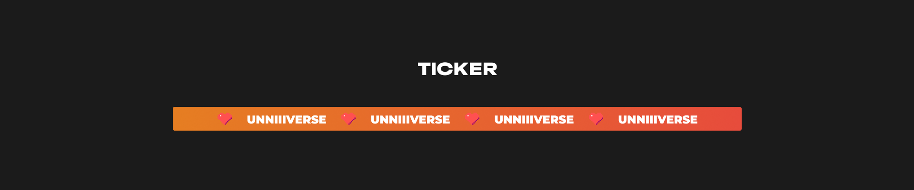

# Ticker


Animated infinite ticker with css and js.

Version: 1.0.1

## Docs
HTML
```html
<div class="uvstm-ticker" id="uvstm-ticker">
  <div class="uvstm-ticker_container">
    <span class="uvstm-ticker_items">
      <span class="uvstm-ticker_item">ITEM</span>
    </span>
  </div>
</div>
```
JS
```javascript
const ticker = new UvstmTicker('[ELEMENT]', '[DURATION](ms, s)');
ticker.init();
```

## Get it now
HTML
```html
<div class="uvstm-ticker" id="uvstm-ticker">
    <div class="uvstm-ticker_container">
      <span class="uvstm-ticker_items">
        <span class="uvstm-ticker_item">ITEM</span>
      </span>
    </div>
  </div>
```

CSS
```
https://unniiiverse.github.io/cdn/module/uvstm/ticker/@1.0.1/style.min.css
```

JS
```
https://unniiiverse.github.io/cdn/module/uvstm/ticker/@1.0.1/app.min.js
```

## [CODEPEN](https://codepen.io/unniiiverse/pen/[MODULE_CODEPEN]) [GITHUB](https://github.com/unniiiverse/uvstm-ticker)
unniiiverse ©️ 2023